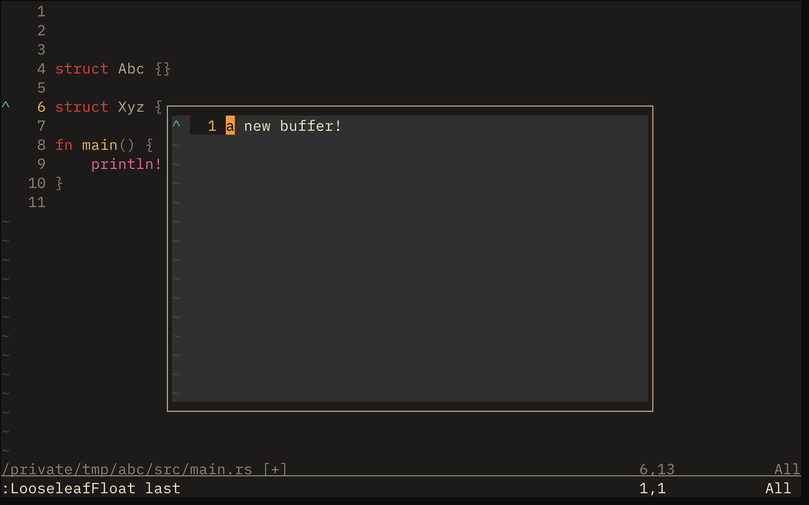

# Looseleaf.nvim

[Watch the demo](./demo.mp4)



This is a plugin for efficiently working with **persistent scratchpad buffers**.

Use cases:
- Write down a quick todo in your todo-list file
- Jot down a couple ideas to reference them later
- ... and any other use case you can come up with

---

## Dependencies
- `stevearc/oil.nvim`

## Storage

The scratchpads are stored in a persistent directory and do not get wiped automatically.
The scratchpad location is configurable, and you can set it to `/tmp` if you would like your buffers to be wiped on reboot.

---

## Quick start

With lazy.nvim:
```lua
{ 'alexkotusenko/looseleaf.nvim' },
```

**Don't forget to run the `setup()` function**
```lua
local looseleaf = require("looseleaf")
looseleaf.setup({
    -- custom scratchpad location
	-- dir = "~/.local/share/nvim/looseleaf.nvim/scratchpads/",  
	special = { -- key-value pairs
		ideas = "ideas.txt",
		todo = "todo.txt",
	},
})
```


---

## Features

These are the currently available commands
- `:LooseleafFloat <?arg>`
    - Opens a scratchpad in a centered floating window
    - (Lightweight option: the floating window can be closed with `q` by default)
- `:LooseleafFull <?arg>`
    - Uses the current window to open a scratchpad
- `:LooseleafList`
    - Lists all the scratchpads in the scratchpad directory
- `:LooseleafSpecial`
    - Lists the special scratchpads
- `:LooseleafSplit <?arg>`
    - Creates a horizontal split above the current window(s) taking 20% of the total height
    - Ideal when you want to keep the scratchpad open for a while without it taking up too much space

`<?arg>` is an optional argument. The possible values are:
- (nothing)
    - generates a new scratchpad in your scratchpad directory and loads it
- `pick`
    - uses a file picker (`oil.nvim` for now) to pick files from your scratchpad dir before opening them
- `last`
    - opens the last opened scratchpad
- `:<special_name>`
    - opens a special scratchpad called `<special_name>`

### Special scratchpads

Special scratchpads are named scratchpads that can be opened without being explicitly picked.
Any special scratchpads have to be configured with the `special` setting in the `setup()` function.
Example:
```lua
special = {
    todo = "./todo.txt",
    rust_buf = "./rust.txt",
    -- add as many as you'd like
}
```
**Note**: the path is relative to your scratchpad directory.

### Configuration
The plugin is configured with the `setup()` command.
Configuration options:
- `dir` (string) - path to your scratchpad directory (default: `~/.local/share/nvim/looseleaf.nvim/scratchpads/`)
- `special` (key-value table) - special scratchpad definition (default: `{}`)
    - **Note** anything but a key-value table will be rejected

## Pro tips
- Use symbolic links in your buffer directory to reference other files
    - You can link both directories and files (directories will be opened with your default file picker)
